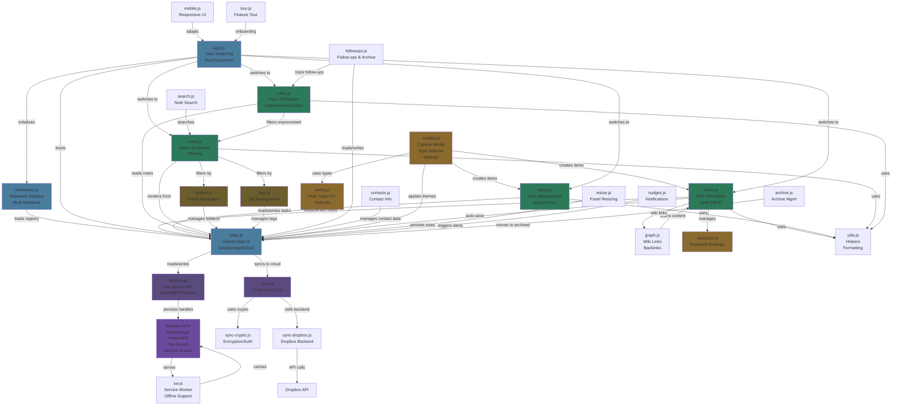

# OrbitHq Architecture

## System Overview

OrbitHq is a note-taking and task management application with a modular architecture. This diagram shows the relationships between all major modules and data flows.



## Module Descriptions

### Core Architecture

| Module | Purpose | Key Exports |
|--------|---------|-------------|
| **app.js** | Boot sequence, view switching (dashboard/inbox) | `showView()`, `_continueBoot()` |
| **state.js** | Global state object `S`, localStorage/cloud persistence | `save()`, `loadAsync()`, `loadSync()` |
| **notebooks.js** | Multi-notebook support, registry persistence | `getActiveNotebook()`, `setActiveId()` |

### Data Persistence

| Module | Purpose | Key Exports |
|--------|---------|-------------|
| **filestore.js** | File System Access API + IndexedDB handles | `fileStore.initForNotebook()`, `readFileForNotebook()` |
| **sync.js** | Cloud sync orchestration, version control | `pushNotebook()`, `pullNotebook()` |
| **sync-dropbox.js** | Dropbox API integration | `handleAuthCallback()`, `uploadToDropbox()` |
| **sync-crypto.js** | Encryption/decryption, auth | `encryptData()`, `decryptData()` |

### UI Views

| Module | Purpose | Key Exports |
|--------|---------|-------------|
| **editor.js** | Rich text editor, note CRUD, wiki linking | `openNote()`, `createNote()`, `saveNote()` |
| **tasks.js** | Task rendering, CRUD, recurrence, auto-archive | `renderTasks()`, `createTask()`, `completeTask()` |
| **inbox.js** | Inbox grid, unprocessed detection, processor | `renderInbox()`, `getInbox()`, `processCard()` |
| **notes.js** | Note list rendering, filtering, badges | `renderNotesList()`, `updateNoteBadges()` |

### Features

| Module | Purpose | Key Exports |
|--------|---------|-------------|
| **folders.js** | Folder tree navigation, CRUD | `renderFolderTree()`, `createFolder()` |
| **tags.js** | Tag management, filtering | `renderTagsSidebar()`, `addTag()` |
| **followups.js** | Follow-up tracking, reminders | `renderFollowUps()`, `createFollowUp()` |
| **contacts.js** | Contact management, mentions | `getContacts()`, `addContact()` |
| **graph.js** | Wiki link parsing, backlinks | `getBacklinks()`, `scanLinks()` |

### Utilities & Config

| Module | Purpose | Key Exports |
|--------|---------|-------------|
| **modals.js** | Capture modal, type selector, settings | `openCapture()`, `openTypeSelector()` |
| **config.js** | Note type definitions (NT object) | `NT` (type registry) |
| **shortcuts.js** | Keyboard shortcuts | `registerShortcut()`, `handleKeydown()` |
| **utils.js** | Formatting, date helpers, common functions | `uid()`, `todayISO()`, `esc()` |
| **search.js** | Full-text note search | `searchNotes()` |
| **archive.js** | Archive management, restore | `viewArchive()`, `restoreTask()` |
| **resize.js** | Panel resize persistence | `savePanelSizes()`, `loadPanelSizes()` |
| **mobile.js** | Mobile/responsive UI adaptations | `updateMobBadges()`, `toggleMobileMenu()` |
| **tour.js** | First-launch feature tour | `startTour()` |
| **nudges.js** | Smart notifications, reminders | `checkNudges()` |

## Data Flow Patterns

### Boot Sequence
```
app.js → notebooks.js → state.js → filestore.js → BROWSER APIs
                                  ↓
                              (try) sync.js → syncDropbox.js → Dropbox
```

### Creating a Note
```
modals.js (capture) → editor.js (createNote) → state.js (S.notes.unshift)
                                              ↓
                                          filestore.js → BROWSER
                                          sync.js → cloud
                                          ↓
                                      notes.js (render) → UI
```

### Processing Inbox
```
inbox.js (getInbox) → state.js (read unprocessed)
                    ↓
                    editor.js (open)
                    ↓
                    folders.js (assign) OR tags.js (add) OR complete
                    ↓
                    state.js (save) → filestore & sync
```

### Searching Notes
```
search.js → state.js (scan S.notes) → filter by content/type/tag/folder
                                    ↓
                                    notes.js (render results)
```

## State Schema (S object)

```javascript
S = {
  tasks: [],           // { id, title, due, recur, noteId, subtasks, createdAt, completedAt }
  archived: [],        // completed tasks
  notes: [],           // { id, type, title, content, metadata, folderId, pinned, createdAt, updatedAt }
  folders: [],         // { id, name, description, parentId }
  tags: [],            // { id, name, color }
  contacts: [],        // { id, name, email, notes }
  followups: [],       // { id, text, dueDate, noteId, completed }
  fuArchived: [],      // archived follow-ups
  fuPanelMode: 'normal', // or 'compact'
  collapsed: {},       // { [sectionId]: boolean }
  noteFilter: 'all',   // 'all' | 'folder:ID' | 'tag:ID' | 'type:TYPE'
  activeNoteId: null,  // currently open note
  navHistory: [],      // breadcrumb navigation
  blOpen: false,       // backlinks panel open
  dismissedCtx: [],    // dismissed contexts
  settings: {
    archiveDelay: 7,
    wordThreshold: 50,
    reviewDay: 1,
    theme: 'clean-dark',
    fontSize: 'default',
    templates: {},
    headingStyles: {}
  },
  session: {
    lastWeekly: null,
    agedSnoozedUntil: null,
    clearedToday: 0,
    clearedDate: null
  }
}
```

## Key Concepts

- **Multi-Notebook**: Each notebook has its own localStorage key (`nucleus_nb_${id}`) and optional File System handle
- **Smart Inbox**: Auto-detection of "unprocessed" items (< word threshold or scratchpad)
- **Auto-Archive**: Completed tasks older than `archiveDelay` days move to `archived`
- **Sync Strategy**: Try cloud first (Dropbox), fallback to local File System, always localStorage
- **Wiki Links**: Editor scans for `[[note-title]]` links, maintains backlinks graph
- **Keyboard First**: Shortcuts.js enables vim-style and standard shortcuts
- **Responsive**: Mobile.js adapts UI for small screens
- **Encryption**: Optional E2E encryption for cloud sync via sync-crypto.js

## Browser APIs Used

- **localStorage**: Primary state persistence
- **IndexedDB**: File handles cache (filestore.js)
- **File System Access API**: Direct notebook file editing
- **Service Worker**: Offline support, caching
- **Dropbox API**: Cloud backup/sync

---

This architecture document should be consulted at the beginning of each session to understand module relationships and data flows.
